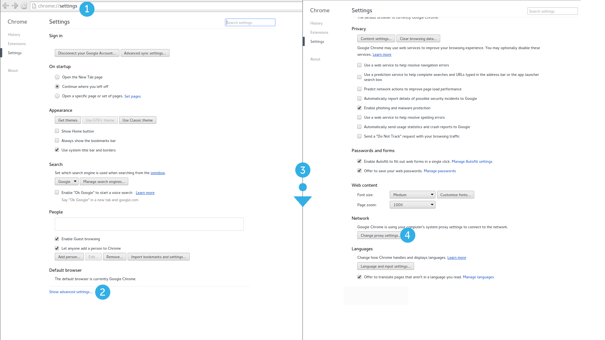
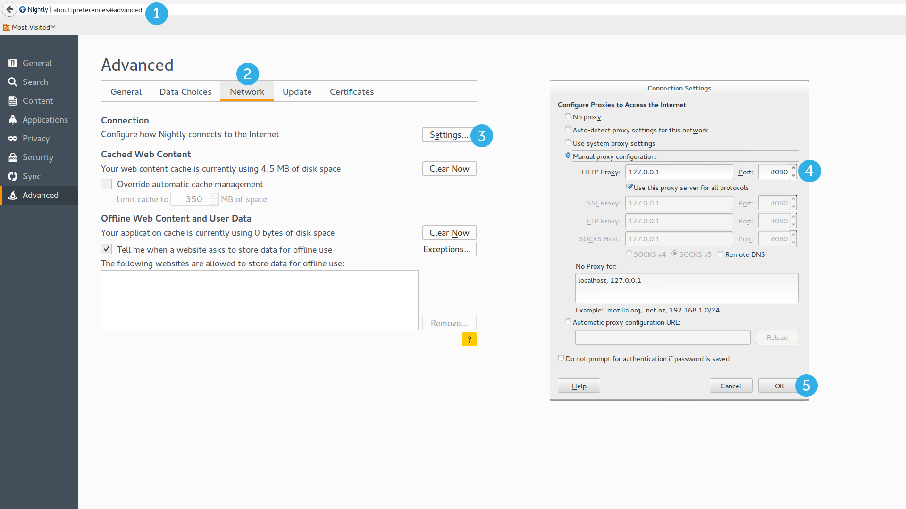
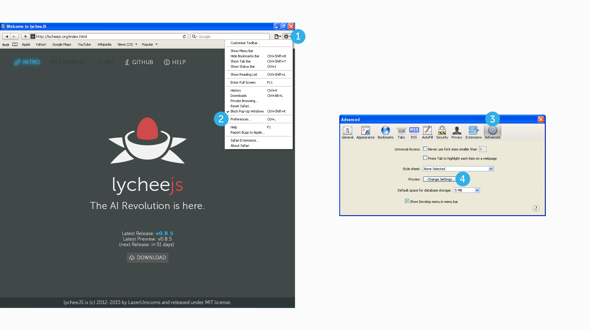
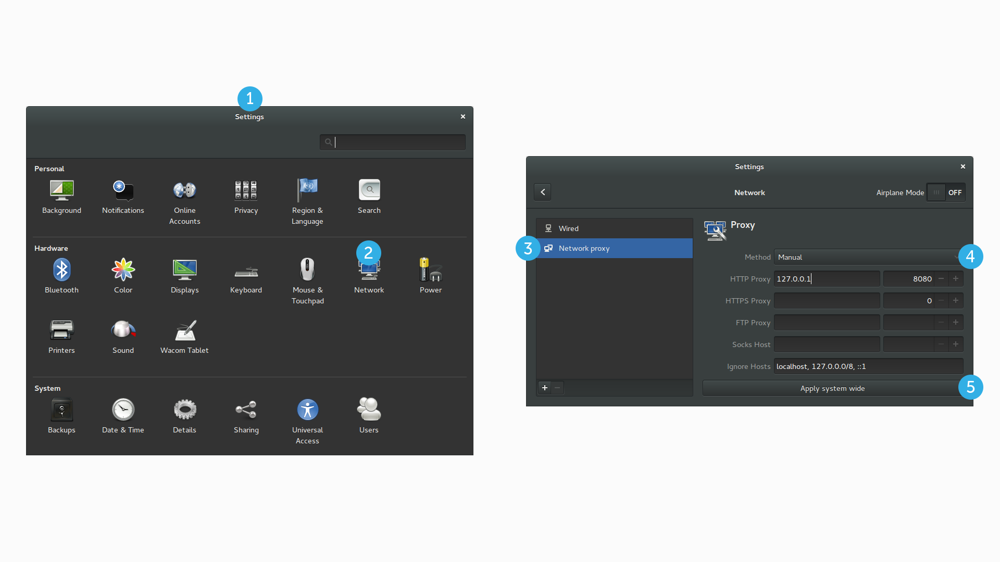
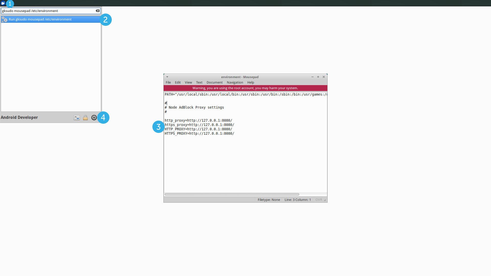
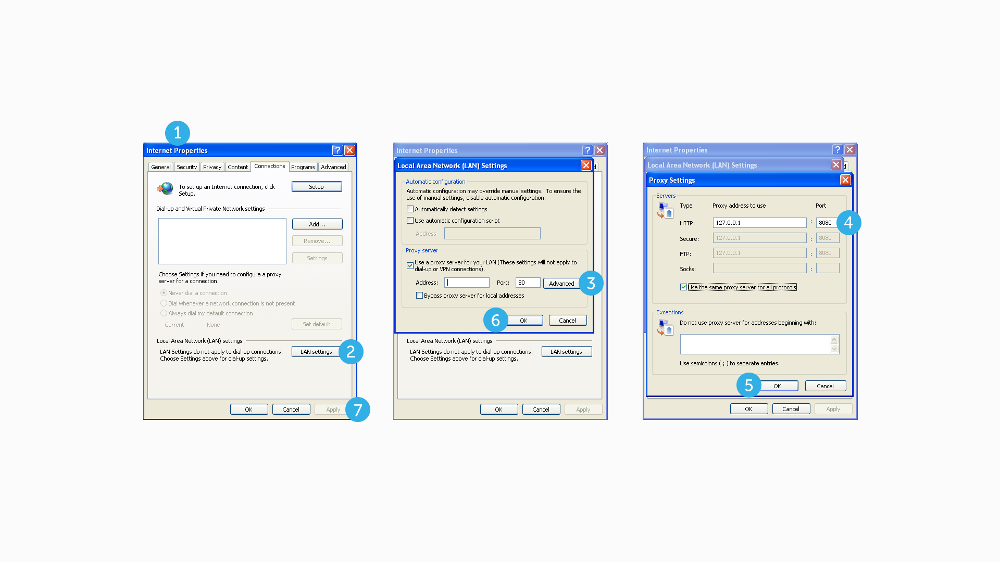

# How to setup your Browser and Desktop Environments

This is a How to edit Proxy Settings Guide that also
covers operating system specific settings.

Contributions welcomed.

- Browsers:
  - [Chrome / Chromium / Opera](#chrome--chromium--opera)
  - [Firefox](#firefox)
  - [Safari](#safari)

- Desktop Environments:
  - [GNOME](#gnome)
  - KDE (missing)
  - [XFCE](#ubuntu-xfce)
  - [Mac OS X](#mac-osx)
  - [Windows XP](#windows-xp)
  - Windows Vista (missing)
  - Windows 7 (missing)
  - Windows 8 (missing)


# Browsers

## Chrome / Chromium / Opera

Chrome, Chromium and Opera use system-wide settings.

1. Go to [chrome://settings](chrome://settings)
2. Click on *Show advanced settings...* (small link on the bottom of the page)
3. Scroll down to the *Network* category
3. Click on *Change proxy settings...* button

This will open the desktop environment's settings window.




## Firefox

Firefox uses either system-wide settings or custom settings.
We recommend to use custom settings, because that allows other applications
(like your E-Mail client) to function normally as expected.

1. Go to [about:preferences#advanced](about:preferences#advanced)
2. Click on *Network* Tab
3. Click on *Settings...* Button
4. In the new Window, select *Manual proxy configuration* and enter details for HTTP Proxy
5. Click on *OK* Button




## Safari

Safari uses system-wide settings.

1. Open the Menu (gear-wheel icon)
2. Select *Preferences*
3. Click on *Advanced* Tab
4. Click on *Change Settings...* Button

This will open the desktop environment's settings window.




# Desktop Environments

## GNOME

1. Open *Settings* Application
2. Select *Network* View
3. Select *Network Proxy* Menu
4. Choose *Manual* as Method and enter details for HTTP Proxy
5. Click on *Apply system wide* Button




## XFCE

1. Open XFCE Menu
2. Execute *gksudo mousepad /etc/environment*
3. Add the following lines to the file and save it
4. Reboot the system (if environment is loaded only on system startup)

```bash
http_proxy=http://127.0.0.1:8080/
https_proxy=http://127.0.0.1:8080/
HTTP_PROXY=http://127.0.0.1:8080/
HTTPS_PROXY=http://127.0.0.1:8080/
```




## Mac OSX

1. Open *System Preferences* Application
2. Select *Network* View
3. Click on *Advanced* Button
4. Select *Proxies* Tab
5. Check *Web Proxy (HTTP)* and enter details for HTTP Proxy
6. Click on *OK* Button
7. Click on *Apply* Button


## Windows XP

If you don't know how to open *Inetcpl.cpl* in command line,
follow the Chrome Browser Tutorial in order to open the
Internet Properties Control Panel.

1. Open *Internet Properties*
2. Click on *LAN settings* Button
3. Check *Use a proxy server ...* and Click on *Advanced* Button
4. Enter details for HTTP Proxy and Check *Use the same proxy server for all protocols*
5. Click on *OK* Button
6. Click on *OK* Button
7. Click on *Apply* Button



